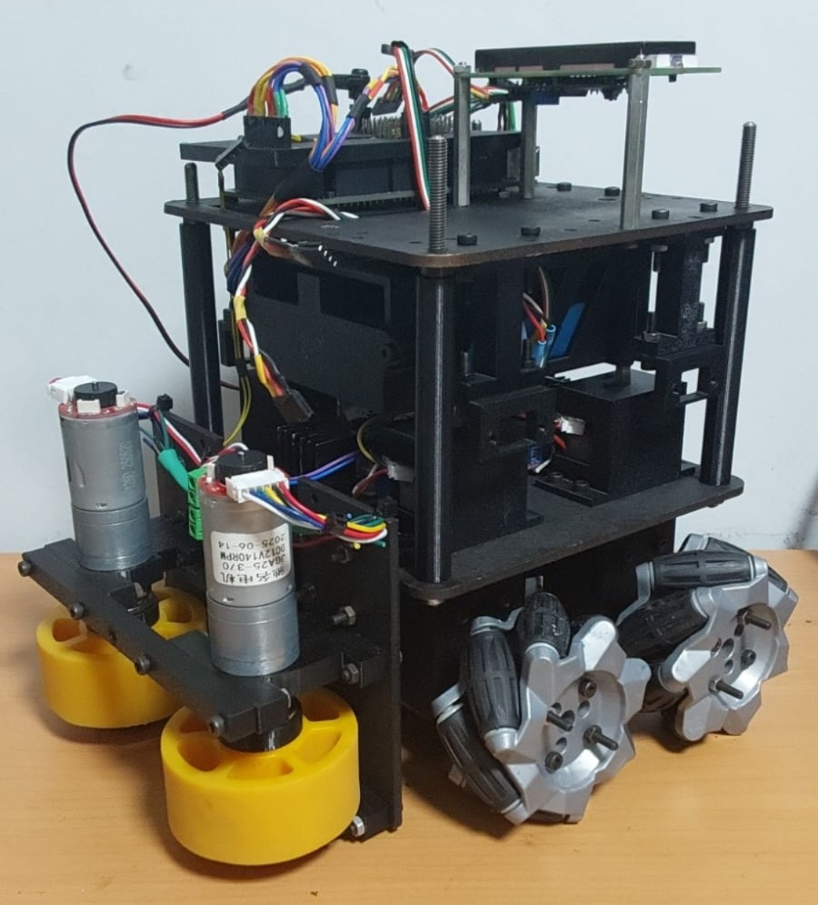
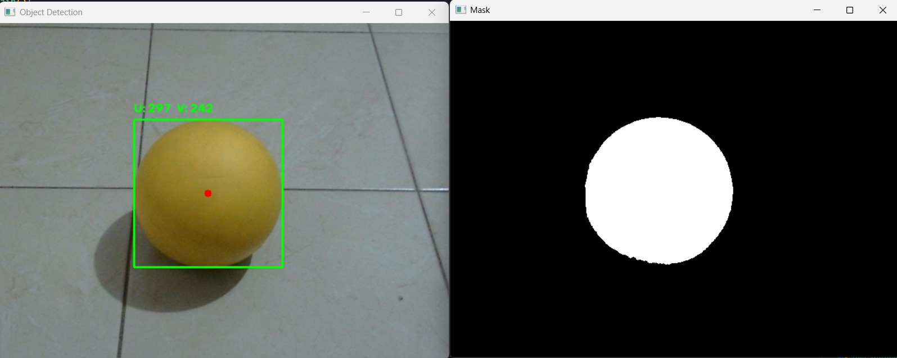
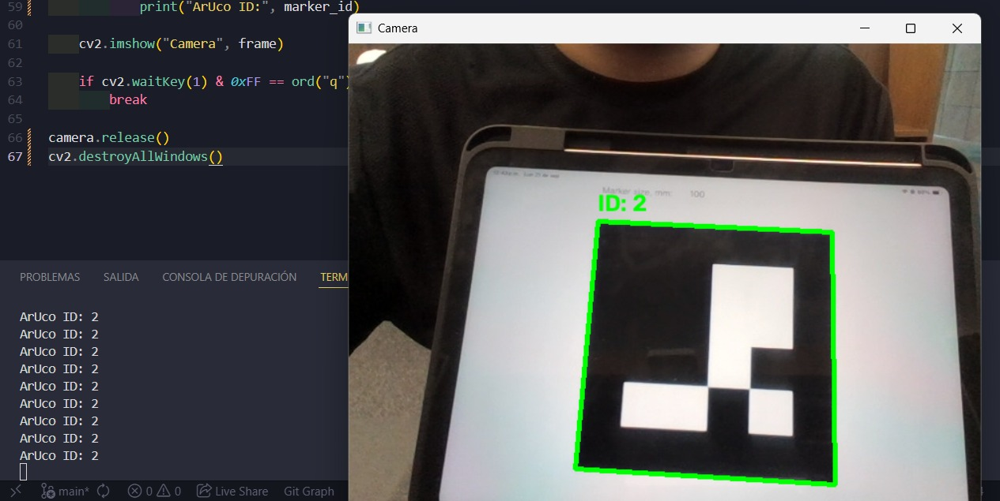

# Vortex-Candidates-2026

<p align="center">
  
</p>

<p align="center">


</p>

---

## Overview

Este repositorio contiene el desarrollo realizado por el equipo **Vortex** para la competencia **Candidates 2026**, correspondiente a los retos **Pista A (MAZE)** y **Pista B (Niveles)**.

El proyecto utiliza una **Raspberry Pi, una cámara y un Arduino** para desarrollar el sistema de control del robot. La Raspberry Pi se encarga principalmente de la lógica, el procesamiento de información y el sistema de visión, mientras que el Arduino se encarga de ejecutar las acciones del robot y proporcionar información de los sensores.

El sistema está siendo desarrollado utilizando **Python, OpenCV y comunicación serial entre la Raspberry Pi y el Arduino**, junto con herramientas de calibración y pruebas para facilitar su implementación durante la competencia.

---

## Setup

Para preparar la Raspberry Pi y ejecutar el proyecto, primero es necesario clonar el repositorio.

### Clone Repository

Desde la Raspberry Pi, ejecutar:

```bash
git clone https://github.com/robberto-carlo/Vortex-Candidates-2026.git
```

Entrar al repositorio:

```bash
cd Vortex-Candidates-2026
```

### Setup Script

El proyecto incluye un script `setup.sh` dentro de la carpeta `raspberry/`, encargado de instalar las dependencias necesarias para ejecutar el sistema.

Entrar a la carpeta `raspberry`:

```bash
cd raspberry
```

Ejecutar el script:

```bash
./setup.sh
```

Al finalizar, el script verifica las versiones instaladas de Python, OpenCV, NumPy y PySerial.

---

## Week 2

Durante la segunda semana se desarrolló la base del sistema de visión.

<p align="center">
  
</p>

### Completed

* Configuración inicial del proyecto.
* Pruebas de captura y procesamiento de imágenes con OpenCV.
* Desarrollo de las funciones básicas para el manejo de la cámara.
* Desarrollo de funciones para la detección de colores.
* Detección mediante HSV y threshold en escala de grises.
* Desarrollo de funciones para la detección de objetos y obtención de sus coordenadas.
* Creación de tests para comprobar las funciones de la cámara.
* Desarrollo de herramientas de calibración para ROI y HSV.

---

## Week 3

Durante la tercera semana se continuó con el desarrollo e integración de los diferentes sistemas necesarios para el funcionamiento de la **Pista A (MAZE)**.

<p align="center">
  
</p>

### Completed

* Configuración del entorno de desarrollo en la Raspberry Pi.
* Instalación y verificación de las dependencias mediante el script `setup.sh`.
* Implementación de la lógica principal para la Pista A (MAZE).
* Implementación de la detección de marcadores ArUco.
* Implementación de la comunicación serial entre Raspberry Pi y Arduino.
* Organización de constantes y parámetros de configuración.

---

## Pista A - MAZE

Se desarrolló la lógica principal para resolver el reto MAZE. La Raspberry Pi obtiene información de los sensores del robot y utiliza estos datos para determinar la siguiente dirección de movimiento.

Se implementó una lógica basada en reglas de navegación que permite decidir entre las direcciones **RIGHT, FRONT, LEFT y BACK**. La prioridad de estas direcciones puede cambiar dependiendo de la regla de navegación utilizada.

También se implementó el almacenamiento de la ruta recorrida, permitiendo utilizarla para el regreso del robot después de encontrar la condición de finalización del laberinto.

## Vision System


Se agregó la **detección de marcadores ArUco** utilizando OpenCV. Esto permite identificar los marcadores presentes en la pista y obtener su ID.

También se integró la detección de ArUco con el procesamiento de cada tile del MAZE, permitiendo obtener información tanto del **color** como del **ArUco** detectado.

El sistema utiliza varias capturas durante un intervalo de tiempo para obtener diferentes lecturas de la cámara y seleccionar la detección predominante. Esto ayuda a reducir errores producidos por detecciones momentáneas.

--- 

## Raspberry Pi - Arduino Communication

Se completó la comunicación entre la **Raspberry Pi y el Arduino mediante comunicación serial**.

La Raspberry Pi envía comandos al Arduino para controlar las acciones del robot y puede solicitar información de sus sensores.

Entre los comandos implementados se encuentran:

* `MOVE`
* `TURN`
* `GET_SENSOR`
* `LCD`

La comunicación utiliza identificadores de comandos para relacionar cada acción enviada con la respuesta correspondiente del Arduino.

También se implementó el manejo de diferentes estados de comunicación, incluyendo la conexión inicial, la pérdida de comunicación y el reinicio del Arduino.

---

## Constants and Configuration

Se agregaron y organizaron constantes para facilitar la configuración del sistema y evitar valores definidos directamente dentro de las funciones.

Entre los parámetros configurables se encuentran:

* Distancias utilizadas para determinar si un camino está libre.
* Distancia de movimiento por tile.
* Grados de giro.
* Tiempo de captura de la cámara.
* Coordenadas de las ROI.
* Rangos HSV.
* Rangos de threshold.
* Áreas mínimas para detección.

---

## Color Detection

Se implementaron diferentes métodos para detectar información de color en las imágenes.

### HSV

La detección mediante HSV permite definir rangos de color y generar una máscara a partir de ellos.

### Threshold

También se implementó detección mediante threshold sobre imágenes en escala de grises, permitiendo separar regiones de la imagen según sus valores de intensidad.

---

## ArUco Detection

Se implementó la detección de marcadores **ArUco** mediante OpenCV.

El sistema utiliza el diccionario:

```text
DICT_4X4_50
```

Para reducir posibles detecciones incorrectas o momentáneas, el sistema realiza múltiples lecturas durante un periodo determinado y selecciona el ID que aparece con mayor frecuencia.

---

## Calibration

El proyecto incluye herramientas para calibrar los parámetros utilizados por el sistema de visión.

### ROI Calibration

Permite seleccionar una **Region of Interest (ROI)** directamente sobre la imagen de la cámara.

Las ROI se almacenan como constantes para poder reutilizarlas en las diferentes partes del programa.

### HSV Calibration

Permite ajustar los valores:

* H Min / H Max.
* S Min / S Max.
* V Min / V Max.

mediante trackbars mientras se observa la cámara y la máscara en tiempo real.

---

## Tests

Se desarrollaron diferentes tests para comprobar el funcionamiento de las funciones de visión.

Actualmente se han realizado pruebas para:

* Cámara.
* Detección de colores.
* Detección de objetos.
* Detección del color dominante.
* Detección de ArUco.

---

## Requirements

### Hardware

* Raspberry Pi.
* Cámara.
* Arduino.

### Software

* Raspberry Pi OS.
* Python.
* OpenCV.
* NumPy.
* PySerial.
* Git.

---

## Team

<p align="center">

<strong>Vortex</strong><br> <em>Candidates 2026</em>

</p>
